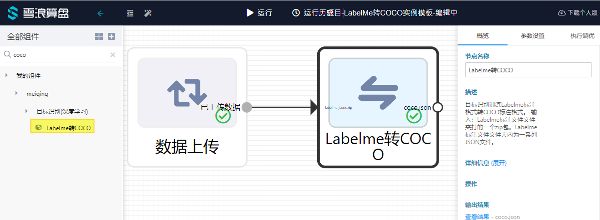
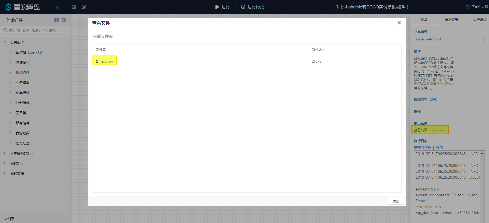

# COCO-a01f9054-867d-4c33-8690-a7100cd1e6bf

## 如何创建实例分割COCO 数据集


在这篇文章中,我将向您展示创建自定义 COCO 数据集以及使用算盘模板快速训练实例分割模型是一件多么简单的事。

实例分割不同于目标识别，因为它需要多边形而不只是矩形框标注（bounding box）。虽然说有许多免费标注工具可供使用，比如[labelme](https://github.com/wkentaro/labelme)易于在所有主要操作系统上安装和运行但是它缺乏导出 COCO 数据格式的原生支持。另一个工具[coco-notator](https://github.com/jsbroks/coco-annotator) ，这是一个基于 Web 的应用程序，要想用它需要付出额外的工作量，比如您需要在计算机上安装web 服务器。那么什么方案是最省力的呢？

下面概述本文介绍的两部曲方案。

* 下载并运行labelme软件,并在图像上标注多边形。
* 运行脚本将labelme标签标注文件转换为 COCO 数据集 JSON 标注文件。

## 使用**labelme**对数据进行标注

[labelme](https://github.com/wkentaro/labelme)和[labelimg](https://github.com/tzutalin/labelImg) 的界面和标注方式类似，但加入了多边形标注功能. 因此,任何熟悉使用labelimg的人士,labelme用起来应该会很自然。

您可以使用如下方式安装labelme,或在[GitHub发布区](https://github.com/wkentaro/labelme/releases/tag/v3.14.2)中找到预编译的Linux/MacOS可执行文件,或者下载我之前build的最新 [Windows 64 位可执行文件](https://github.com/Tony607/labelme2coco/releases/download/V0.1/labelme.exe)。

```text
# python3
conda create --name=labelme python=**3.6**source activate labelme
# or "activate labelme" on Windows
# conda install -c conda-forge pyside2
# conda install pyqt
pip install pyqt5 # pyqt5 can be installed via pip on python3
pip install labelme
```

打开该工具时,单击"Open Dir"按钮并导航到图像文件所在路径,然后即可开始绘制多边形。完成一个多边形的绘制,请按回车键,该工具应自动连接第一个点和最后一个点。完成当前图像标注后,快捷键"D"将带您到下一个图像。我标注了18张图像,每张图像包含多个目标,花了大约30分钟。本实例中使用的图片和标注可以在[此GitHub链接](https://github.com/Tony607/labelme2coco)上下载。


对所有图像进行标注后,您可以在图像目录中找到与图片文件名同名的 JSON 文件。这些是 labelimg 的标注文件,我们将在下一步将它们转换为单个 COCO 数据集标注 JSON 文件。\(或两个文件，如果您打算做训练/测试集拆分的话\)。

## 将标注文件转换为 COCO 数据集格式

您可以在 GitHub 上找到[labelme2coco.py](https://github.com/Tony607/labelme2coco/blob/master/labelme2coco.py) 脚本文件. 用他来转换标注文件格式,只需传递一个图像目录路径参数即可。

```text
python labelme2coco.py images
```

此脚本依赖三个python pip包:labelme、numpy和pillow。执行脚本后,您将在当前目录中找到名为 trainval.json 的文件,即为 COCO 数据集注释 JSON 文件。

然后,您可以选择通过打开 [COCO\_Image\_Viewer.ipynb](https://github.com/Tony607/labelme2coco/blob/master/COCO_Image_Viewer.ipynb) jupyter 笔记本来验证COCO标注的数据.

如果一切正常,它应该显示类似下面的内容。


您也可以用算盘中的**Labelme转COCO**组件完成同一个功能。



您可以在参数设置中修改默认输出的JSON文件名。

此节点输入，输出定义为：

* 输入：Labelme标注文件文件夹打的一个zip包。Labelme标注文件文件夹内为一系列JSON文件。您可以下载参考[本实例中使用的zip文件](https://suanpan-test.oss-cn-beijing.aliyuncs.com/sp_share/labelme_jsons.zip)，并上传给数据上传组件。
* 输出：包含单个COCO数据标注的JSON文件的文件夹。

该节点运行结束后可以在查看结果中找到输出的COCO JSON标注文件。



### 下一步

用算盘训练一个实例分割模型，请参考文档：[实例分割模板\(mmdetection\)使用](https://www.notion.so/mmdetection-a61b3e66b474496b9de904c238d301ef)。

