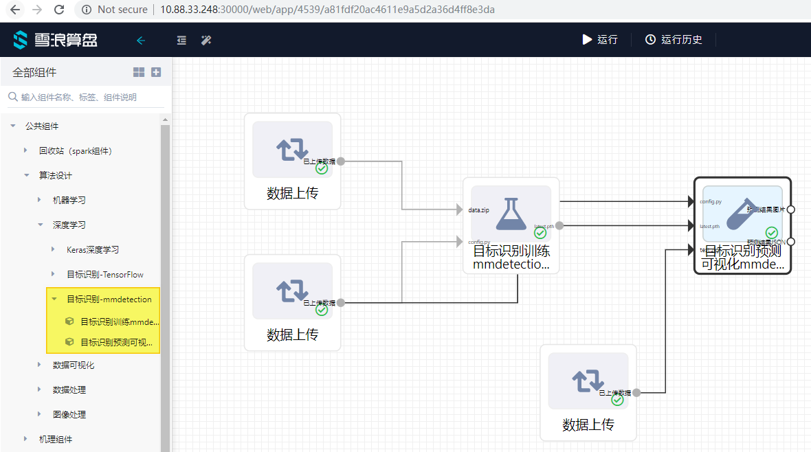
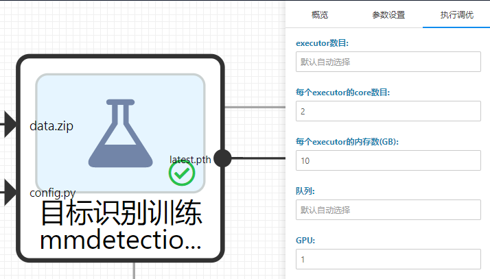
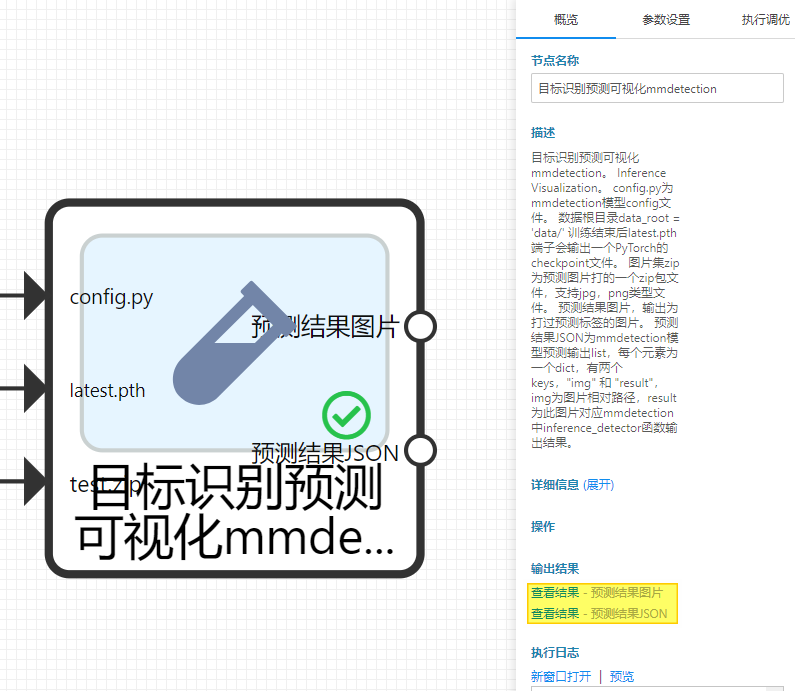
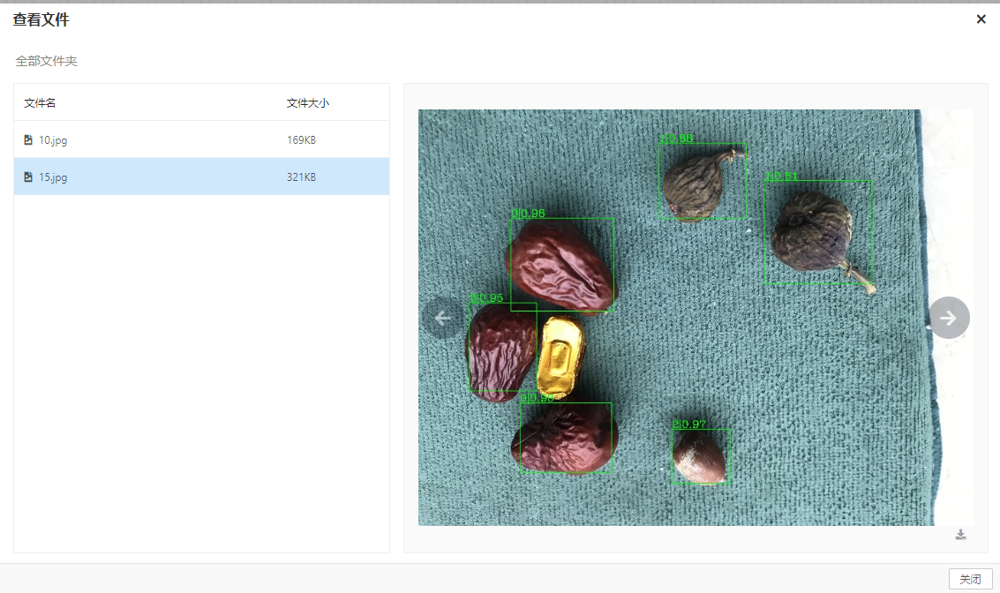

# mmdetection-49a2b8b3-5787-4e2f-a2f8-972a4e2af324

模板ID：4539



_算盘文档目标识别模板\(mmdetection\)_

目标识别模板（mmdetection），用于定位图片中的物体。需要在配置过GPU加速的机器上运行，关于算盘GPU主机安装可以参考“\[算盘GPU主机安装\(CentOS7\)\]\([https://github.com/xuelang-group/suanpan-docs/wiki/%E7%AE%97%E7%9B%98GPU%E4%B8%BB%E6%9C%BA%E5%AE%89%E8%A3%85\(CentOS7\)\)”文档。如果您只能在CPU机器上运行，请考虑使用\[目标识别模板（TensorFlow）\]\(https://github.com/xuelang-group/suanpan-docs/wiki/%E7%AE%97%E7%9B%98%E6%96%87%E6%A1%A3-%E7%9B%AE%E6%A0%87%E8%AF%86%E5%88%AB\)。](https://github.com/xuelang-group/suanpan-docs/wiki/%E7%AE%97%E7%9B%98GPU%E4%B8%BB%E6%9C%BA%E5%AE%89%E8%A3%85%28CentOS7%29%29”文档。如果您只能在CPU机器上运行，请考虑使用[目标识别模板（TensorFlow）]%28https://github.com/xuelang-group/suanpan-docs/wiki/%E7%AE%97%E7%9B%98%E6%96%87%E6%A1%A3-%E7%9B%AE%E6%A0%87%E8%AF%86%E5%88%AB%29。)

保证训练节点有足够的计算资源，不然在训练时候可能会报内存不足的错误。



_分配资源_

目标识别节点底层使用[mmdetection](https://github.com/open-mmlab/mmdetection)框架，框架内部使用PyTorch深度学习库。

## **节点使用介绍**

### 目标识别训练mmdetection

接收上传的data.zip训练数据压缩包文件训练目标识别模型。

关于data.zip文件的内容，你可以下载下列文件并参考：[https://suanpan-test.oss-cn-beijing.aliyuncs.com/sp\_share/data\_coco.zip](https://suanpan-test.oss-cn-beijing.aliyuncs.com/sp_share/data_coco.zip)

压缩前文件结构如下，压缩前建议将您的图片大小做适当的压缩并归一化，比如归一化为1333 \* 800 的图片以减小后续文件的处理时间。

```text
.
├── images
│   ├── 0.jpg
│   ├── 10.jpg
│   ├── ...
│   ├── 8.jpg
│   └── 9.jpg
├── test.json
└── trainval.json
```

json文件为标注文件，标注格式为[COCO](http://cocodataset.org/#format-data)。你可以下载并使用[labelImg](https://tzutalin.github.io/labelImg/)标注工具对你的图片进行标注，然后转为COCO格式的数据，具体脚本可以参考[voc2coco.py](https://github.com/Tony607/voc2coco/blob/master/voc2coco.py)。

config.py为mmdetection模型config文件。你可以下载下列config文件[faster\_rcnn\_r50\_fpn\_1x.py](https://suanpan-test.oss-cn-beijing.aliyuncs.com/sp_share/faster_rcnn_r50_fpn_1x.py)作参考，或在此基础上修改模型、训练参数比如total\_epochs和imgs\_per\_gpu。可以参考[mmdetection/configs](https://github.com/open-mmlab/mmdetection/tree/master/configs)中其他的config文件。需要注意的是，数据根目录请配置为 data\_root = 'data/'

如果您主机安装了多个GPU，可以在“参数设置”中增加GPU数量参数，提升训练效率。


_修改GPU数量_

训练结束后latest.pth端子会输出一个PyTorch的checkpoint文件。

### 目标识别预测可视化mmdetection

此节点加载训练完的模型并对上传的test.zip中的图片进行预测、框出识别的物体。运行后可视化结果图片可以在右面板查看。

config.py为mmdetection模型config文件。

latest.pth端子为训练节点输出的PyTorch的checkpoint文件。

test.zip为预测图片打的一个zip包文件，支持jpg，png类型文件。你可以下载下列文件作参考：[https://suanpan-test.oss-cn-beijing.aliyuncs.com/sp\_share/test.zip](https://suanpan-test.oss-cn-beijing.aliyuncs.com/sp_share/test.zip)

预测结果图片，输出为打过预测标签的图片。

预测结果JSON为mmdetection模型预测输出的一个list，每个元素为一个dict，每个dict有两个keys，"img" 和 "result"，img为图片相对路径，result为此图片对应mmdetection中inference\_detector函数返回的结果。此json文件可以通过右面板下载并作为离线分析使用，也可接后续组件做后续分析。



_查看结果_

下图每个检测到的物体左上角显示了分类标签和概率。标签为从0开始的整数，对应按名称排序的文本标签。



_可视化图片效果_

